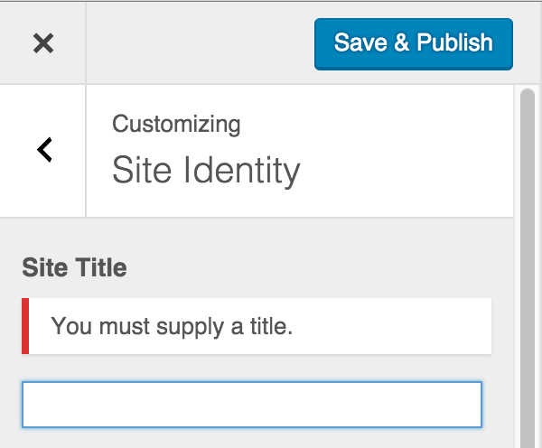
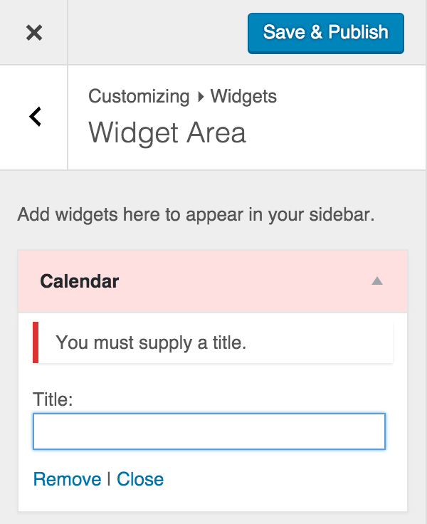
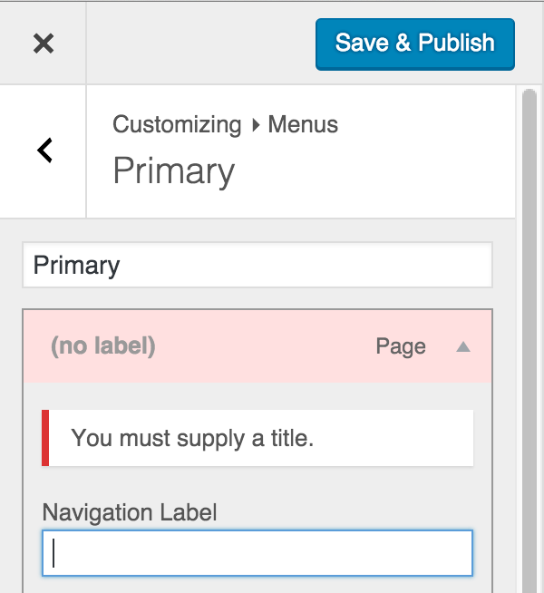

<!-- DO NOT EDIT THIS FILE; it is auto-generated from readme.txt -->
# Customize Setting Validation


Core feature plugin for Customizer setting validation, error messaging, and transactional/atomic saves. See Trac #34893.

**Contributors:** [westonruter](https://profiles.wordpress.org/westonruter), [xwp](https://profiles.wordpress.org/xwp)  
**Requires at least:** 4.4  
**Tested up to:** 4.6-alpha  
**Stable tag:** 0.1.2  
**License:** [GPLv2 or later](http://www.gnu.org/licenses/gpl-2.0.html)  

[](https://travis-ci.org/xwp/wp-customize-setting-validation) [](https://coveralls.io/github/xwp/wp-customize-setting-validation) [](http://gruntjs.com) [](https://david-dm.org/xwp/wp-customize-setting-validation#info=devDependencies) 

## Description ##

This feature plugin allows setting values to be validated and for any validation errors to block the Customizer from
saving any setting until all are valid. Additionally, once a successful save is performed on the server, any settings
that have resulting PHP-sanitized values which differ from the JS values will be updated on the client to match, while
retaining the non-dirty saved state.

The functionality here will be proposed for inclusion in WordPress Core via Trac [#34893](https://core.trac.wordpress.org/ticket/34893):
Improve Customizer setting validation model.

See demo video of “[Customize Validate Entitled Settings](https://gist.github.com/westonruter/1016332b18ee7946dec3)” plugin which forces the site title, widget titles, and nav menu item labels to all be populated and to start with an upper-case letter:

[](https://www.youtube.com/watch?v=ZNk6FhtS8TM)

Settings in the Customizer rely on sanitization to ensure that only valid values get persisted to the database. The sanitization in the Customizer generally allows values to be passed through to be persisted and does not enforce validation that blocks the saving of the value. This is in large part because there is no standard facility for showing error messages relating to Customizer controls, and there is no standard method to raise validation errors. A Customizer setting _can_ be blocked from being saved by returning `null` from the `WP_Customize_Setting::sanitize()` method (i.e. generally returned via `customize_sanitize_{$setting_id}`). When this is done, however, the modified value completely disappears from the preview with no indication for why the value seems to be reset to the default.

In JavaScript there is the `wp.customize.Setting.prototype.validate()` method that can be extended to return `null` in the case where the value should be rejected, but again this does not provide a way to display a validation message: the user can be entering data but they just stop seeing the value making changes in the preview without any feedback. Even worse, if the JS `validate` method actually manipulates the value to make it valid, there can be strange behavior in the UI as the user provides input, likely having to do with the two-way data binding of `wp.customize.Element` instances.

Furthermore, if one setting is blocked from being saved by means of validation in the sanitization method, the other settings in the Customizer state may very well be completely valid, and thus they would save successfully. The result is that some settings would get saved, whereas others would not, and the user wouldn't know which were successful and which failed (again, since there is no standard mechanism for showing validation error message). The Customizer state would only partially get persisted to the database. This isn't good.

Lastly, once the settings are successfully saved, if any of the PHP-sanitization differs in any way from the JS-sanitization on the client, the difference in value will not be apparent in the Customizer controls.

So this plugin aims to solve both these problems by:

* Validating settings on server before save.
* Displaying validation error messages from server and from JS client.
* Performing transactional/atomic setting saving, rejecting all settings if one is invalid.
* Sync back the PHP-sanitized saved setting values to the JS client and ensure controls are populated with the actual persisted values.

Note that the transactional/atomic saving here in setting validation is not the same as the [Customizer Transactions proposal](https://make.wordpress.org/core/2015/01/26/customizer-transactions-proposal/), although the two are complimentary. A transaction should not be published/committed until all of its settings are valid.

To do server-side validation of a setting, implement a setting sanitizer that returns `null` or a `WP_Error` object:

```php
<?php
$wp_customize->add_setting( 'year_established', array(
	'type' => 'option',
	'sanitize_callback' => function ( $value ) {
		$value = intval( $value );

		// Apply strict validation when the sanitize callback is called during.customize_validate_settings.
		if ( doing_action( 'customize_validate_settings' ) && ( $value < 1900 || $value > 2100 ) ) {
			return new WP_Error( 'invalid_value', __( 'Year must be between 1900 and 2100.' ) );
		}

		$value = min( 2100, max( $value, 1900 ) );
		return $value;
	}
) );
```

The validation error message can also be set programmatically by JS by calling `setting.validationMessage.set()`,
for example from an extended `setting.validate()` method. The `validationMessage` is inspired by HTML5.

For a demonstration of the functionality made possible with this Customizer setting validation API,
including how to do client-side validation, see the “[Customize_Validate_Entitled_Settings](https://gist.github.com/westonruter/1016332b18ee7946dec3)” plugin.
It will validate that the Site Name (`blogname`), nav menu item titles, and widget titles are all fully populated.
The validation is done both on the client and on the server.

## Screenshots ##

### Invalid site title.



### Invalid widget title.



### Invalid nav menu item title.



## Changelog ##

### 0.1.2 ###
Prevent invalid value from being accepted due to logic error with a variable leaking into the next loop iteration.

### 0.1.1 ###
* Handle relative `WP_CONTENT_DIR` in locate_plugin.
* Add banner and icon for WP plugin directory.
* Prevent validation message from sliding up/down repeatedly.
* Reset validation message element height to auto after slideDown finishes.
* Add missing wp-util dependency.

### 0.1 ###
Initial release.


